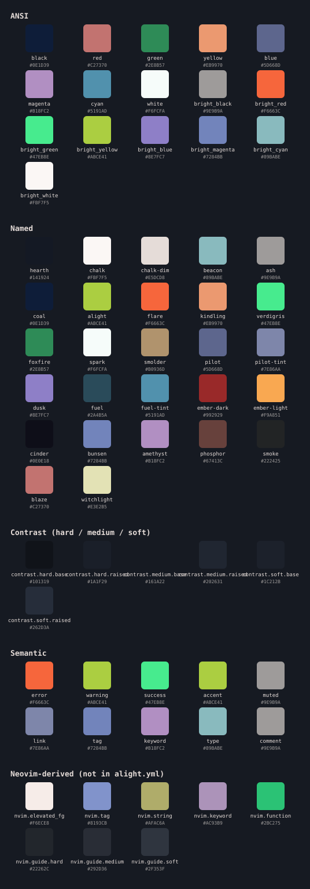

# ember

Small, practical developer tools with design and UX in mind.

Welcome to the hearth. Here, it's nice and cosy. And tools are readily available for you to use and modify.

---

## Why this exists

I like tools that do one thing well and then stop and leave me alone.
No "all-in-one" solutions, but small and sharp tools that live in the terminal and get out of your way once they've done their job.

A few things I'll try to stick to when developing the ember universe further:

- **One tool, one job**: if it starts needing a plugin system it's grown past what it was supposed to be.
- **Plain files**: I like my files like my coffee: plain. Whatever a tool writes to disk, you should be able to open, read, and edit it without that tool installed.
- **Terminal-first**: A GUI has to earn its place, not be the default.
- **A bit of personality is fine**: Tools with some voice are more fun to use than tools that just quietly do their job.

---

## What's in the works

Some of these are further along than others. A couple are barely more than a name, or a whiff of an idea.

| tool           | what it does                                        | status             |
| -------------- | --------------------------------------------------- | ------------------ |
| ember-alight   | terminal theme & ember branding                     | in progress        |
| ember-ash      | low-bandwidth, DOM-first CLI browser                | concept            |
| ember-flare    | traces HTTP/SPARQL traffic between local containers | concept            |
| ember-flint    | CP/M-inspired file explorer                         | early development  |
| ember-forge    | editor for type designers and typographers          | concept            |
| ember-kiln     | SPARQL / RDF query & transform CLI                  | concept            |
| ember-kindling | practice git, branch by branch                      | concept            |
| ember-smolder  | Linked Data Event Streams (LDES) client             | pre-alpha          |
| ember-wildfire | plain-markdown notes; ideas that spread and link    | active development |

## ember colour palette

---

## Where things stand

Still early days. Some of these might just stay ideas forever. Check a tool's own folder for the current state of things as I won't be able to promise to keep this file up-to-date.

---

## License

MIT (per tool — see individual folders).
